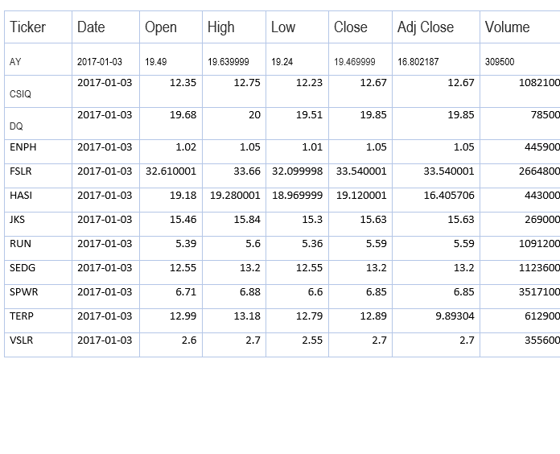

# VBA_Challenge
## VBA Challenge Project Overview
There are two primary purposes of this analysis. One, it provides additional practice in coding in VBA, especially in how loops work and two, it provides practice in and understanding the value of refactoring one’s code.

## The Scenario
The scenario for this analysis is that Steve is creating this VBA driven Excel analysis to help his parents make a smart choice in investing in renewable energy stocks. Looking into the initial stock his parents recommended, DQ, which stands for DAQO New Energy Corporation, Steve realized he would need to include other renewable energy stocks in his analysis.

## Initial Module 2 Scenario Analysis
The module 2 analysis, see the green_stocks_20200715.xlsm file [green_stocks_20200715.xlsm] (https://github.com/davidmcbee/stock-analysis.git), provided 12 stocks and the following metrics, in table 1, for those stocks over 2017 and 2018. This table is a sample showing all the stocks and one line of metrics for each of those stocks for 2017.  See above link for entire data set

*Table 1/2017 Data Example

the module 2 analysis resulted in the DQ Analysis worksheet. This analysis for 2018 shows that the return for DQ for 2018 was negative 62.6 percent. This dismal answer prompted the analysis of all 12 stocks, shown in the All Stocks Analysis worksheet.

## Module 2 Code Review
The primary goal of coding the VBA for this All Stocks Analysis, aside from practice in VBA, was to use a loop and a sub loop to progress through the 12 stocks, the outer loop, and to progress through all rows in the analysis, 3012 rows containing stocks (3013 – the header row), the inner loop. You can refer to the Module2AllStocksAnalysis.txt file [Module2AllStockAnalysis.txt] (https://github.com/davidmcbee/VBA_Challenge/blob/VBA_Challenge_Edits/Module2Resources/Module2AllStockAnalysis.txt) for the entire code in the All Stocks Analysis subroutine but the pertinent section is as follows

### Pseudocode
* Using the i = 9 to 11 outer loop for the ticker array which contains the 12 stock tickers.
* For each stock ticker in the outer loop, loop through all rows, 3012 rows, the inner loop, to find the yearly volume, the starting price and the ending price for the stock ticker that the outer loop is on.

This analysis provides the desired result, shown in the All Stocks Analysis worksheet but the performance of using those 2 loops in this way is inefficient, which will be explained in the results section below.

## VBA Challenge Analysis
In this challenge, the VBA_Challenge.xlsm file, [VBA_Challenge.xlsm] (https://github.com/davidmcbee/VBA_Challenge/blob/master/VBA_Challenge.xlsm), the All Stocks Analysis was redone to refactor the code, the 2nd main purpose of this analysis. Note that both the code for the original All Stocks Analysis, subroutine All Stocks Analysis as well as the All Stocks Analysis Refactored subroutine code are contained in the VBA_Challenge.xlsm file

## VBA Challenge Code Review
In this version the same section of code that was done in 2 loops in the original All Stocks Analysis subroutine is now done in one loop. The entire code can be viewed in the VBS_Challenge_Code.txt file [VBA_Challenge_Code.txt] (https://github.com/davidmcbee/VBA_Challenge/blob/master/Module2Resources/VBS_Challenge_Code.txt). The  relevant difference, stated in pseudo code is

### VBA Challenge Pseudocode
*Create 4 arrays, the original ticker array, a volume array a starting price array and an ending price array.
*Using a ticker index to fill the appropriate array cell and keep all arrays in sync, loop through all the stock rows, 3112, filling the ticker volumes, the ticker starting prices and the ticker ending prices. An added part to this loop is to increase the ticker index after the loop has gotten through all the instances of a particular index. This precludes having to have 2 loops.

## Scenario Results
The results for the scenario are fairly straight forward. The stocks ENPH and RUN performed the best over 2018 and all the stocks except for TERP were positive for 2017.

## Refactoring Performance Results
The results of factoring the code show a significant difference in performance between the All Stocks Analysis subroutine and the All Stocks Analysis Refactored subroutine.

### Primary Results
Please refer to the Performance Results worksheet in the VBA_Challenge.xlsm file. There was an 82.2 percent improvement between the two subroutines. The refactored code is significantly better. Let’s look at the reason why. In the original subroutine. The inner loop goes through every row to store the volume, starting and ending prices for one ticker symbol. There are 249 rows of data per stock ticker. This means each inner loop goes through 3012 rows in order to capture data for 249 of those rows. The extra 2,763 rows it transverses provide no value. This is then multiplied by 12, the 12 ticker symbols representing the outer loop. This results in 33,156 wasted steps.

### Refactroing Results over Multiple Runs
first, lets look at the difference between 2017 and 2018 for both the original and refactored subroutines. One can see from the Perfromance Results worksheet and figures 1 and 2 below that the diffence in subroutines for 2017 showed a 82.2 percent improvement in elapsed time. Figure 2 shows a 82.1 percent improvment in elapsed time. The average elapsed  time difference for both 2017 and 2018 is 82.2 percent.  Further Figure 3 indicates there is no meaningfull differene in performance between 2017 and 2018.

Figure 1

Figure 2

Figure 3

I diverged from the instructions for creating pictures of the run times and including them but, I believe it is for a good reason. I ran each 2017 and 2018 worksheet, for both the subroutines, 10 times. The results are in the Performance Results worksheet in the VBA_Challenge.xlsm file. I wanted to understand if the differences in time between each run changed and was there a difference in times between the 1st run and subsequent runs? Were the run times increasing, decreasing or fairly consistent?

#### Initial and subsequent Run Conclusion
I found that, with one exception, the original All Stocks Analysis run for 2018, all the times decreased between the 1st run and the 2nd run. I rebooted my computer between each set of runs to ensure cache and in memory storage was not a factor. See Figures 4 and 5

Figure 4

Figure 5

#### Consistency of Elapsed Run Times
I also conclude that runs 2 through 10 did not have an appreciable slope. That is, they did not tend to increase or decrease in elapsed time of the runs but, the difference in times between the two subroutines showed an 11.7 percent decrease in in elapsed time differences. The elapsed time in the refactored subroutine was less and also more consistent. My assumption is that this is due to the 82.2 percent improvement in the elapsed time of the refactored subroutine; the less elapsed time the less the differences between runs.     

## Summary Advantages and Disadvantages of Refactoring Code
Experience in coding should help the coder create the code in the most efficient manner possible the first time but everyone can benefit from refactoring to see if efficiencies can be gained. Just like any writing, editing is needed to improve the product. Thus, the advantages are a better product; more efficient, better comments, less errors and better understanding down the road when someone comes back to that code. The disadvantage is that this takes time. With experience the time to refactor should decrease but is still needed.

## Summary, Advantages and Disadvantages of Refactoring the original VBA Code
The advantage of the refactored subroutine is an 82.2 percent improvement in the elapsed time it takes to run the subroutine. Additionally, each run has a more consistent time, a 11.7 percent improvement.
This original subroutine was obviously designed so that the comparison between the original and the refactored subroutine conveys the value of refactoring; an obvious, and good, learning point. I would extrapolate this out to a larger and more real-world example where the code is much longer. Each little gain in efficiency would really add up over longer code.   
I can’t say there is a valid reason not to refactor the original sub routine. One possible rationalization is that in a business situation where time constraints are more intense, refactoring and the degree of refactoring is balanced against deadlines. Both sub routines produce the desired result. If speed of producing the deliverable is critical an initial effort that produces the correct results, regardless of performance, might be acceptable.
